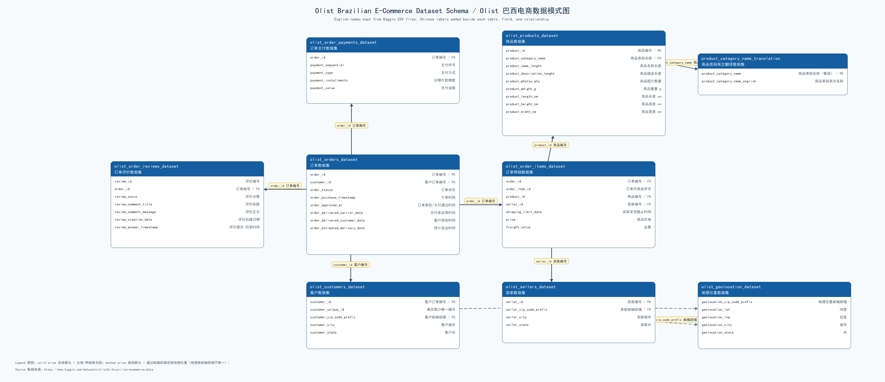

# 巴西 Olist 电商经营分析

基于 Olist Brazilian E-Commerce 公共数据集完成的端到端数据分析项目。项目使用 SQL Server 进行数据准备、质量检查、分析建模和业务视图构建，并使用 Power BI 制作经营诊断仪表板，覆盖经营总览、品类趋势、客户价值、商家风险、物流优化和营销增长六个主题。

[查看最终 Power BI 报告（PDF）](Olist_Ecommerce_Dashboard.pdf)

## 项目目标

- 建立可复用、可校验的电商业务数据模型。
- 统一订单、GMV、客户、商家、评分和配送等核心指标口径。
- 识别高价值客户、客户流失风险和客户运营机会。
- 对商家进行经营分层，定位高风险与物流重点优化对象。
- 分析品类、区域、星期和商品组合表现，发现增长机会。
- 将 SQL 分析结果接入 Power BI，形成可交互的经营诊断仪表板。

## 数据模型



数据来源：[Brazilian E-Commerce Public Dataset by Olist](https://www.kaggle.com/datasets/olistbr/brazilian-ecommerce)。原始 CSV 数据未包含在本仓库中，请从数据集页面自行下载。

## 项目实施顺序

| 阶段 | 文件 | 主要内容 |
| --- | --- | --- |
| 1 | [`Phase_1_Data_Preparation.sql`](Phase_1_Data_Preparation.sql) | 创建数据库和正式业务表，清洗暂存数据，建立约束、索引及基础地理视图，并执行完整性检查。 |
| 2 | [`Phase_2_Foundational_Queries.sql`](Phase_2_Foundational_Queries.sql) | 使用筛选、聚合、排序和多表关联完成基础业务探索与指标口径验证。 |
| 3 | [`Phase_3_Advanced_Analysis.sql`](Phase_3_Advanced_Analysis.sql) | 使用 CTE、子查询、窗口函数和多层聚合构建订单、客户、卖家、月度经营及物流分析视图。 |
| 4 | [`Phase_4_Data_Integrity_and_Optimization.sql`](Phase_4_Data_Integrity_and_Optimization.sql) | 建立数据质量报告，补充约束和索引，并创建可复用的存储过程与商品销售汇总视图。 |
| 5 | [`Phase_5_Business_Insights.sql`](Phase_5_Business_Insights.sql) | 构建 KPI、同比、预测、RFM、CLV、流失、商家分层、物流风险和交叉销售等 Power BI 业务视图。 |
| 6 | [`Olist_Ecommerce_Dashboard.pdf`](Olist_Ecommerce_Dashboard.pdf) | 使用 Power BI 完成数据模型、DAX 指标与六个分析主题页面。 |
| 7 | 经营建议 | 根据客户、商家、物流和营销分析结果形成可执行的运营建议。 |

## Power BI 报告内容

最终报告共 7 页，包括 1 页封面和 6 个分析模块：

1. **经营总览**：平台实付金额、订单数、买家数、客单价、平均评分、晚到率及月度趋势。
2. **品类与销售趋势**：重点品类月度 GMV、Top 品类、年度同比、移动平均、简单预测及区域品类表现。
3. **客户价值与流失**：RFM、12 个月 CLV、客户分层、高价值客户和流失风险。
4. **商家分层与经营风险**：商家数量与 GMV 分层、留存表现、经营规模、晚到率及商家明细。
5. **物流流向与优化**：地区配送天数、晚到率、州际线路风险及卖家—品类配送风险。
6. **营销与增长机会**：高频共购组合、商家留存、工作日与周末销售表现及 RFM 运营建议。

## 技术栈

- **数据库**：Microsoft SQL Server、SSMS
- **数据处理与分析**：T-SQL、CTE、窗口函数、视图、存储过程、索引
- **可视化**：Power BI Desktop、Power Query、DAX
- **版本管理**：Git、GitHub

## 使用方法

1. 从 Kaggle 下载 Olist 原始数据集。
2. 在 SQL Server 中导入 9 个 CSV，并将暂存表命名为：
   - `stg_olist_customers_dataset`
   - `stg_product_category_name_translation`
   - `stg_olist_sellers_dataset`
   - `stg_olist_products_dataset`
   - `stg_olist_orders_dataset`
   - `stg_olist_order_items_dataset`
   - `stg_olist_order_payments_dataset`
   - `stg_olist_order_reviews_dataset`
   - `stg_olist_geolocation_dataset`
3. 在 SSMS 中按照阶段 1 至阶段 5 的顺序执行 SQL 文件。
4. 打开最终 PDF 查看分析结果；如需重新制作 Power BI 报告，可使用阶段 3 至阶段 5 创建的业务视图作为数据源。

> 阶段 1 会创建并使用数据库 `Olist_Ecommerce_Learning`。执行前请确认暂存表已经导入，并根据自己的 SQL Server 环境检查权限设置。

## 仓库结构

```text
Olist_Ecommerce_Analytics/
├── Phase_1_Data_Preparation.sql
├── Phase_2_Foundational_Queries.sql
├── Phase_3_Advanced_Analysis.sql
├── Phase_4_Data_Integrity_and_Optimization.sql
├── Phase_5_Business_Insights.sql
├── Olist_Ecommerce_Dashboard.pdf
├── olist_data_schema.png
└── README.md
```

## 说明

- 项目结构参考了 [Power BI Projects 2](https://github.com/tubakrc/Power_BI_Projects_2)，SQL 实现、分析模型和 Power BI 报告均基于本项目的数据处理与学习成果整理。
